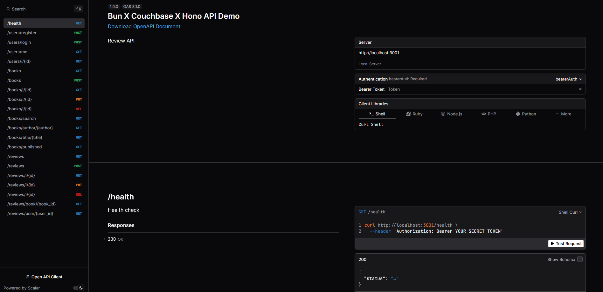
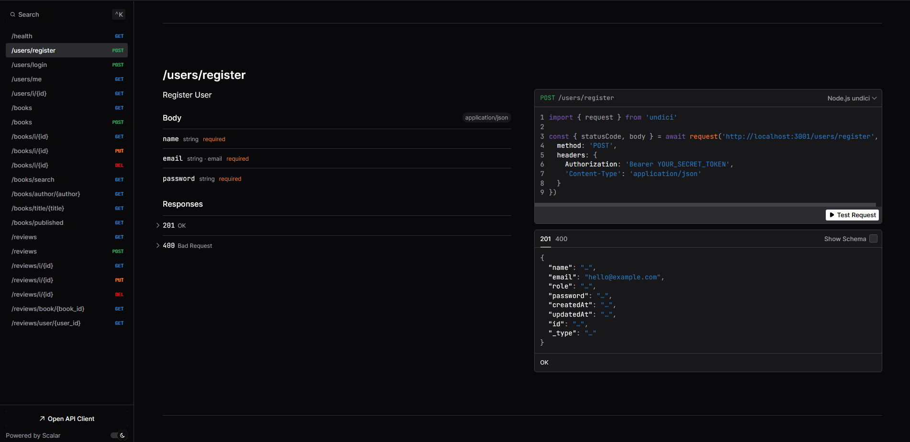

## Hono X Couchbase


This is a simple project to demonstrate how to use Nodejs with Couchbase Server via the official Nodejs SDK and bun.

## Prerequisites

- Bun (v1.1.43) - [https://bun.sh](https://bun.sh)
- Couchbase Server (v7) - [https://www.couchbase.com](https://www.couchbase.com)

## Project Structure

The project structure is based on the MVC pattern. The structure is as follows:

```
├── app.ts         -> This is the main file where the application is initialized
├── index.ts       -> This is the entry point of the application
├── config         -> This is where the configuration files are stored
│   ├── env.ts
│   └── ottoman.ts
├── controllers    -> This is where the controllers are stored
│   ├── book.controller.ts
│   ├── review.controller.ts
│   └── user.controller.ts
├── middlewares    -> This is where the middlewares are stored
│   └── auth.middleware.ts
├── models         -> This is where the models are stored
│   ├── book.model.ts
│   ├── review.model.ts
│   └── user.model.ts
├── routes         -> This is where the routes are stored
│   ├── book.router.ts
│   ├── review.router.ts
│   └── user.router.ts
├── schemas        -> This is where the validation schemas are stored
│   ├── book.ts
│   ├── healthcheck.ts
│   ├── review.ts
│   └── user.ts
├── services       -> This is where the business logic is stored
│   ├── book.service.ts
│   ├── review.service.ts
│   └── user.service.ts
└── validators     -> This is where the validation schemas are stored
    ├── books.ts
    ├── healthcheck.ts
    ├── reviews.ts
    └── users.ts
```

## Docs


